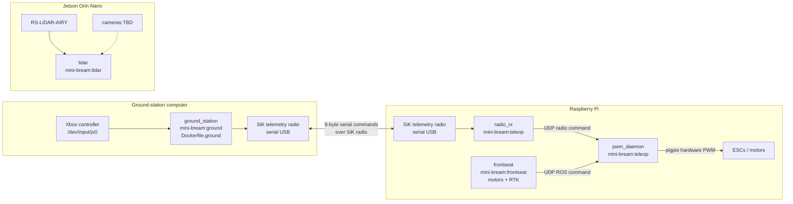

# Docker architecture

This document covers the production, teleoperation, ground-station, and Jetson perception images.



## Images and services

- `Dockerfile.ground` builds `mini-bream:ground` (ground-station computer).
- `Dockerfile.teleop` builds `mini-bream:teleop` (`radio_rx`, `pwm_daemon` on the Pi).
- `Dockerfile.frontseat` builds `mini-bream:frontseat` (Pi: motor control + RTK).
- `Dockerfile.lidar` builds `mini-bream:lidar` (Jetson: RoboSense Airy; cameras later).

## Compose files

| Compose file | Host | Services |
|--------------|------|----------|
| `docker-compose.ground.yml` | Ground station | ground |
| `docker-compose.frontseat.yml` | Pi / Jetson | Pi: `pwm_daemon`, `radio_rx`, `frontseat` · Jetson: `lidar` |

## Motor command priority

`pwm_daemon` chooses one source:

1. Fresh, armed radio command
2. Fresh ROS command
3. Neutral motor output if neither source is valid

## Start commands

Ground station:

```bash
docker compose -f docker-compose.ground.yml up --build
```

Pi (motors + RTK):

```bash
docker compose -f docker-compose.frontseat.yml up -d --build pwm_daemon radio_rx
docker compose -f docker-compose.frontseat.yml up --build frontseat
```

Jetson (LiDAR):

```bash
# Secondary IP for factory LiDAR destination (see rslidar_airy README)
sudo LIDAR_IFACE=eth0 \
  ../ros2_ws/src/frontseat/config/rslidar_airy/setup_network.sh

docker compose -f docker-compose.frontseat.yml up --build lidar
```

If Jetson `docker compose build` fails with DNS errors (`iptables: false` daemon), build with:

```bash
docker build --network=host -f Dockerfile.lidar -t mini-bream:lidar ../
```

The `lidar` service sets `build.network: host` for the same reason.

See `../ros2_ws/src/frontseat/config/rslidar_airy/README.md` and `../teleop/README.md`.
