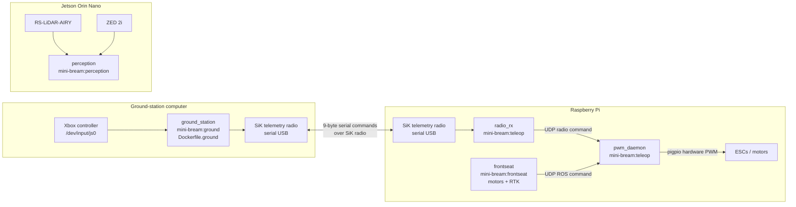

# Docker architecture

This document covers the production, teleoperation, ground-station, and Jetson perception images.



## Images and services

- `Dockerfile.ground` builds `mini-bream:ground` (ground-station computer).
- `Dockerfile.teleop` builds `mini-bream:teleop` (`radio_rx`, `pwm_daemon` on the Pi).
- `Dockerfile.frontseat` builds `mini-bream:frontseat` (Pi: motor control + RTK).
- `Dockerfile.perception` builds `mini-bream:perception` (Jetson: RoboSense Airy + ZED 2i).

## Compose files

| Compose file | Host | Services |
|--------------|------|----------|
| `docker-compose.ground.yml` | Ground station | ground |
| `docker-compose.frontseat.yml` | Pi / Jetson | Pi: `pwm_daemon`, `radio_rx`, `frontseat` · Jetson: `perception` |

## Motor command priority

`pwm_daemon` chooses one source:

1. Fresh, armed radio command
2. Fresh ROS command
3. Neutral motor output if neither source is valid

## Start commands

Ground station:

```bash
docker compose -f docker-compose.ground.yml up --build
```

Pi (motors + RTK):

```bash
docker compose -f docker-compose.frontseat.yml up -d --build pwm_daemon radio_rx
docker compose -f docker-compose.frontseat.yml up --build frontseat
```

Jetson (LiDAR + ZED 2i):

```bash
# Secondary IP for factory LiDAR destination (see rslidar_airy README)
sudo LIDAR_IFACE=eth0 \
  ../ros2_ws/src/frontseat/config/rslidar_airy/setup_network.sh

# ZED calibration file must exist in config/zed2i/settings/ (see zed2i README)
docker compose -f docker-compose.frontseat.yml up --build perception
```

If Jetson `docker compose build` fails with DNS errors (`iptables: false` daemon), build with:

```bash
docker build --network=host -f Dockerfile.perception -t mini-bream:perception ../
```

The `perception` service sets `build.network: host` for the same reason.

See `../ros2_ws/src/frontseat/config/rslidar_airy/README.md` and `../teleop/README.md`.

## Cross-host ROS (Pi ↔ Jetson)

Both hosts use `network_mode: host`, so Docker is not isolating ROS traffic. Topics are discovered via DDS on the LAN.

Requirements:

1. **Same RMW** — both `frontseat` (Pi) and `perception` (Jetson) use `RMW_IMPLEMENTATION=rmw_cyclonedds_cpp`. Fast DDS and Cyclone cannot talk to each other.
2. **Same domain** — set the same `ROS_DOMAIN_ID` on both (default `0`).
3. **Multicast** — Cyclone DDS discovers peers via multicast on `192.168.0.0/24`. Some Wi‑Fi routers block this; use wired Ethernet or add a Cyclone peer list (below).

Verify from Pi:

```bash
docker exec mini_bream_frontseat bash -lc \
  'source /opt/ros/humble/setup.bash && source /workspace/ros2_ws/install/setup.bash && ros2 topic list | grep -E zed|rslidar'
```

If topics still do not appear after rebuilding `frontseat`, create `src/docker/cyclonedds.xml` and mount it on both services:

```xml
<?xml version="1.0" encoding="UTF-8" ?>
<CycloneDDS>
  <Domain>
    <General>
      <Interfaces>
        <NetworkInterface name="eth0"/>
      </Interfaces>
    </General>
    <Discovery>
      <Peers>
        <Peer address="192.168.0.100"/>  <!-- Pi -->
        <Peer address="192.168.0.102"/>  <!-- Jetson -->
      </Peers>
    </Discovery>
  </Domain>
</CycloneDDS>
```

Set `CYCLONEDDS_URI=file:///path/to/cyclonedds.xml` in both compose services.
