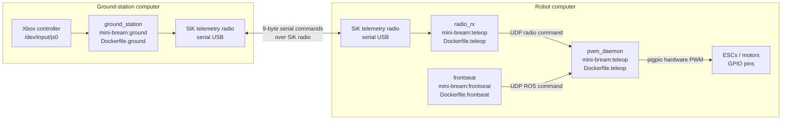

# Docker architecture

This document covers the production, teleoperation, and ground-station images.



## Images and services

- `Dockerfile.ground` builds `mini-bream:ground`.
  - Runs on the ground-station computer.
  - Reads the Linux joystick device directly.
  - Sends left/right thrust, deadman state, sequence number, and CRC through the ground SiK radio.
  - It uses Docker's default isolated network; it does not expose joystick data to the robot ROS graph.

- `Dockerfile.teleop` builds `mini-bream:teleop`.
  - Runs the robot's `radio_rx` and `pwm_daemon` services.
  - Builds and starts `pigpiod` for Raspberry Pi hardware PWM.
  - `radio_rx` converts serial radio frames into local UDP commands.
  - `pwm_daemon` is the only process allowed to control the motor pins.

- `Dockerfile.frontseat` builds `mini-bream:frontseat`.
  - Provides ROS 2 Humble and the dependencies needed by `frontseat` and `joystick_control`.
  - Mounts and builds `ros2_ws`.
  - ROS motor commands are forwarded to `pwm_daemon`; this container does not own the GPIO pins.

## Compose files

- `docker-compose.ground.yml` is started on the ground-station computer.
- `docker-compose.frontseat.yml` is started on the robot and contains:
  - `pwm_daemon`
  - `radio_rx`
  - `frontseat`

## Motor command priority

`pwm_daemon` chooses one source:

1. Fresh, armed radio command
2. Fresh ROS command
3. Neutral motor output if neither source is valid

This keeps emergency radio control available if ROS stops.

## Start commands

Ground station:

```bash
docker compose -f docker-compose.ground.yml up --build
```

Robot:

```bash
docker compose -f docker-compose.frontseat.yml up -d --build pwm_daemon radio_rx
docker compose -f docker-compose.frontseat.yml up --build frontseat
```

See `../teleop/README.md` for device discovery, controller mapping, safety behavior, and detailed setup.
