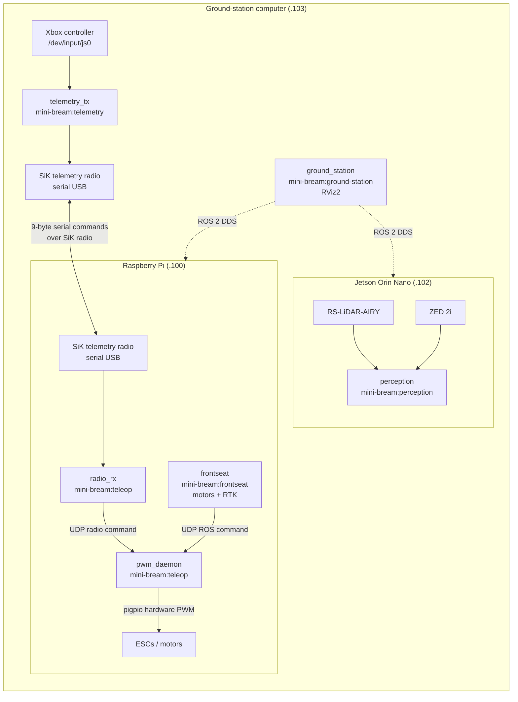

# Docker architecture

This document covers the production, teleoperation, ground-station, and Jetson perception images.



## Images and services

- `Dockerfile.ground_station.telemetry_tx` builds `mini-bream:telemetry` (joystick → SiK radio, no ROS).
- `Dockerfile.ground_station` builds `mini-bream:ground-station` (RViz2 topic viewer).
- `Dockerfile.teleop` builds `mini-bream:teleop` (`radio_rx`, `pwm_daemon` on the Pi).
- `Dockerfile.frontseat` builds `mini-bream:frontseat` (Pi: motor control + RTK).
- `Dockerfile.perception` builds `mini-bream:perception` (Jetson: RoboSense Airy + ZED 2i).

## Compose files

| Compose file | Host | Services |
|--------------|------|----------|
| `docker-compose.ground.telemetry.yaml` | Ground PC | `telemetry_tx` (emergency teleop radio) |
| `docker-compose.ground.yml` | Ground PC (`.103`) | `ground_station` (RViz2) |
| `docker-compose.frontseat.yml` | Pi / Jetson | Pi: `pwm_daemon`, `radio_rx`, `frontseat` · Jetson: `perception` |

## Motor command priority

`pwm_daemon` chooses one source:

1. Fresh, armed radio command
2. Fresh ROS command
3. Neutral motor output if neither source is valid

## Start commands

Use the role launcher (recommended):

```bash
cd src/docker
chmod +x mini_bream_env.sh

./mini_bream_env.sh start pi       # pwm_daemon + radio_rx + frontseat
./mini_bream_env.sh start jetson   # LiDAR network + perception
./mini_bream_env.sh start gs       # telemetry_tx + RViz ground_station

./mini_bream_env.sh stop pi        # remove Pi containers (compose down -v)
./mini_bream_env.sh stop jetson    # remove perception
./mini_bream_env.sh stop gs        # remove ground_station + telemetry_tx
```

Start options: `--build`, `--dry-run` (Pi PWM safe mode), `--no-telemetry` (GS RViz only), `--detach-frontseat`.

Manual compose commands:

```bash
docker compose -f docker-compose.ground.telemetry.yaml up --build
```

Ground station RViz2 (same LAN as robot, `192.168.0.103`):

```bash
xhost +local:docker
docker compose -f docker-compose.ground.yml up --build
```

Pi (motors + RTK):

```bash
docker compose -f docker-compose.frontseat.yml up -d --build pwm_daemon radio_rx
docker compose -f docker-compose.frontseat.yml up --build frontseat
```

Jetson (LiDAR + ZED 2i):

```bash
# Secondary IP for factory LiDAR destination (see rslidar_airy README)
sudo LIDAR_IFACE=eth0 \
  ../ros2_ws/src/frontseat/config/rslidar_airy/setup_network.sh

# ZED calibration file must exist in config/zed2i/settings/ (see zed2i README)
docker compose -f docker-compose.frontseat.yml up --build perception
```

If Jetson `docker compose build` fails with DNS errors (`iptables: false` daemon), build with:

```bash
docker build --network=host -f Dockerfile.perception -t mini-bream:perception ../
```

The `perception` service sets `build.network: host` for the same reason.

See `../ros2_ws/src/frontseat/config/rslidar_airy/README.md` and `../teleop/README.md`.

## Cross-host ROS (Pi ↔ Jetson ↔ ground station)

All ROS hosts use `network_mode: host`, so Docker is not isolating ROS traffic. Topics are discovered via DDS on the LAN.

Requirements:

1. **Same RMW** — `frontseat`, `perception`, and `ground_station` use `RMW_IMPLEMENTATION=rmw_cyclonedds_cpp`. Fast DDS and Cyclone cannot talk to each other.
2. **Same domain** — set the same `ROS_DOMAIN_ID` on all hosts (default `0`).
3. **Static peers** — `cyclonedds.xml` (Pi), `cyclonedds.jetson.xml` (Jetson, pin `192.168.0.102`), `cyclonedds.ground.xml` (ground station, Wi-Fi). Mount the correct file per host.

Verify from ground station:

```bash
docker exec mini_bream_ground_station bash -lc \
  'source /opt/ros/humble/setup.bash && ros2 topic list | grep -E zed|rslidar|fix|pwm'
```

Verify from Pi:

```bash
docker exec mini_bream_frontseat bash -lc \
  'source /opt/ros/humble/setup.bash && source /workspace/ros2_ws/install/setup.bash && ros2 topic list | grep -E zed|rslidar'
```

Peer list in `src/docker/cyclonedds.xml`:

```xml
<Peer address="192.168.0.100"/>  <!-- Pi -->
<Peer address="192.168.0.102"/>  <!-- Jetson -->
<Peer address="192.168.0.103"/>  <!-- Ground station (RViz) -->
```

Set `CYCLONEDDS_URI=file:///etc/cyclonedds.xml` in each compose service.

## Static TF (`base_link` frame tree)

Sensor mount transforms live in `../ros2_ws/src/frontseat/config/tf/blueboat_extrinsics.yaml` and are published by `static_tf_broadcaster` on **Jetson perception** only. The ZED wrapper publishes the internal camera chain (`zed_camera_link` → optical frames) with `publish_tf:=true`; only the boat mount `base_link` → `zed_camera_link` is in the YAML. Ground station RViz uses fixed frame `base_link` and receives the tree over DDS.

## Bandwidth report

After changing router or Wi‑Fi setup, measure sensor load vs link capacity:

```bash
cd src/docker
chmod +x bandwidth_report.sh

# From Pi (SSH keys to Jetson + ground). Optional passwords via env:
# export SSHPASS_JETSON=... SSHPASS_GROUND=...
./bandwidth_report.sh | tee reports/bandwidth_$(date +%Y%m%d_%H%M%S).txt
```

Override hosts/paths if needed:

```bash
PI_IP=192.168.0.101 GROUND_IP=192.168.0.103 ROUTER_MODEL="MyNewRouter" \
  GROUND_REPO="/path/to/mini-bream/src/docker" \
  ./bandwidth_report.sh
```

Requires: `perception` on Jetson, `frontseat` on Pi (optional), `mini-bream:ground-station` image on ground, `iperf3` for link test. Takes ~3–5 minutes.
