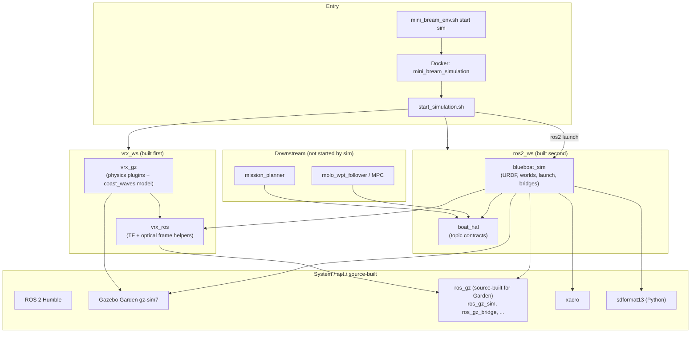

# BlueBoat Gazebo Simulation (`blueboat_sim`)

HAL-backed VRX simulation for testing navigation (MPC, mission planner, etc.) with the same topic contract as field hardware.

## Quick start

```bash
cd src/docker
./mini_bream_env.sh start sim --build
```

Second shell inside the container:

```bash
docker exec -it mini_bream_simulation bash
cd /workspace/ros2_ws && source install/blueboat_sim/share/blueboat_sim/local_setup.bash
ros2 launch blueboat_sim open_water.launch.py
```

Default Docker launch: `lidar_obstacle_course.launch.py` with world `lidar_obstacle_course_harner`.

## Worlds

| Launch | Default world | Purpose |
|--------|---------------|---------|
| `open_water.launch.py` | `open_water_harner` | MPC / path following |
| `lidar_obstacle_course.launch.py` | `lidar_obstacle_course_harner` | LiDAR obstacle course |

## H0 experiment in simulation

```bash
# Terminal 1: simulation
ros2 launch blueboat_sim open_water.launch.py headless:=True

# Terminal 2: MPC (H0 baseline)
cd src/ros2_ws/src/molo_wpt_follower/mpc
python3 mpc.py --config experiments/results/lemniscate_validation/H0_baseline/config.yaml
```

Use overlay `molo_wpt_follower/h0_boat/config/h0_sim_hal_overlay.yaml` for `/blueboat/...` topics.

## HAL topics (sim)

See `boat_hal/config/sim.yaml`. Core topics:

| Signal | Topic |
|--------|-------|
| GPS | `/blueboat/sensors/gps/gps/fix` |
| IMU | `/blueboat/sensors/imu/imu/data` |
| Ground truth odom | `/blueboat/sensors/position/ground_truth_odometry` |
| Thrust | `/blueboat/thrusters/{left,right}/thrust` |
| LiDAR (alias) | `/rslidar_points` |
| Camera (alias) | `/zed/zed/rgb/color/rect/image` |

Real hardware uses `/wamv/...` via `frontseat`; sim uses `/blueboat/...`.

## Model

- **URDF / meshes:** `blueboat_sim/urdf/`, `blueboat_sim/meshes/` (ArduPilot SITL BlueBoat geometry)
- **Dynamics:** VRX `libSurface.so` + `libSimpleHydrodynamics.so` (`urdf/dynamics/blueboat_dynamics_plugin.xacro`)
- **Mass:** 30 kg; T200 thrusters; spawn `z` default 0.15 m

## Water surface

Worlds reference the `coast_waves` model from `vrx_gz` (6 km visual water mesh). Buoyancy uses VRX `Surface` plugins on the hull, not the legacy standalone `BuoyancyEngine` stack.

---

# Dependency tree

## 1. Big picture



**Runtime flow:**

```
mini_bream_env.sh
  → Docker container (mini_bream_simulation)
    → start_simulation.sh
      → colcon build vrx_gz + vrx_ros
      → colcon build blueboat_sim + boat_hal
      → ros2 launch blueboat_sim lidar_obstacle_course.launch.py
```

---

## 2. Build-time tree

### A. `vrx_ws` — physics + VRX assets

| Package | Role | Depends on |
|---------|------|------------|
| **`vrx_ros`** | `pose_tf_broadcaster`, `optical_frame_publisher`, `monitor_sim.py` | `rclcpp`, `ros_gz_bridge`, `tf2_ros`, … |
| **`vrx_gz`** | Gazebo plugins + `coast_waves` model + extra worlds | `vrx_ros`, `gz-sim7`, `ament_cmake_python` |

**Plugins used by BlueBoat sim:**

| Plugin (`vrx_gz`) | Used by |
|-------------------|---------|
| `libSurface.so` | BlueBoat buoyancy (`urdf/dynamics/blueboat_dynamics_plugin.xacro`) |
| `libSimpleHydrodynamics.so` | BlueBoat hydrodynamics |
| `libUSVWind.so` | World wind |
| `libPublisherPlugin.so` | Wavefield params topic |
| `libLightBuoyPlugin.so` | Course buoys (harner worlds) |

`start_simulation.sh` builds only `vrx_gz` and `vrx_ros` (not `wamv_gazebo`, `wamv_description`, or `vrx_gazebo`).

### B. `ros2_ws` — BlueBoat sim + HAL

| Package | Role | Depends on |
|---------|------|------------|
| **`blueboat_sim`** | URDF, meshes, worlds, launch, spawn/bridge Python | `vrx_ros`, `ros_gz_*`, `robot_state_publisher`, `topic_tools`, `boat_hal`, `xacro` |
| **`boat_hal`** | Topic name contracts (`/blueboat/...` in sim) | ROS message packages |

---

## 3. Inside `blueboat_sim`

```
blueboat_sim/
├── launch/                    → open_water, lidar_obstacle_course
├── worlds/*.sdf               → simulation environments
├── urdf/                      → robot, sensors, VRX dynamics plugins
├── meshes/                    → visual/collision meshes
├── models/spawn_tmp/          → generated model.urdf + spawn.sdf at runtime
├── hook/resource_paths.sh     → GZ_SIM_RESOURCE_PATH when package is sourced
└── blueboat_sim/vrx/          → minimal VRX launch/spawn/bridge fork
    ├── sim_launch.py          → shared launch + HAL relays
    ├── launch.py              → gz sim, spawn, bridges, robot_state_publisher
    ├── model.py               → xacro → URDF → SDF, spawn request
    ├── bridges.py             → clock, wind, pose, joint_states
    └── payload_bridges.py     → camera, lidar, IMU, GPS, thrusters, odometry
```

**Launch chain:**

```
lidar_obstacle_course.launch.py / open_water.launch.py
  → sim_launch.py
    → vrx/launch.py::simulation()     → ros_gz_sim (gz sim + world SDF)
    → vrx/launch.py::spawn()          → gz service create + ros_gz_bridge
    → vrx/model.py::Model             → xacro + gz sdf -p
    → topic_tools relay               → /rslidar_points, /zed/...
    → vrx_ros::pose_tf_broadcaster
    → robot_state_publisher
```

---

## 4. Runtime / environment dependencies

| Component | Purpose |
|-----------|---------|
| **Gazebo Garden (`gz-sim7`)** | Physics simulation |
| **`ros_gz` (Garden build in `/opt/ros_gz_ws`)** | `ros_gz_sim`, `ros_gz_bridge` — apt Humble `ros_gz` is not used |
| **`GZ_SIM_RESOURCE_PATH`** | `coast_waves`, worlds, spawn assets |
| **`AMENT_PREFIX_PATH`** | `package://blueboat_sim/...` (also resolved to absolute paths in `model.py`) |
| **NVIDIA runtime** | GPU lidar in Docker |

Set in `start_simulation.sh`:

```
GZ_SIM_RESOURCE_PATH =
  blueboat_sim/share              ← package:// resolution
  blueboat_sim/worlds
  blueboat_sim/models
  vrx_gz/models                   ← coast_waves, course props
  vrx_gz/worlds
```

---

## 5. World → asset → plugin dependencies

Example: `lidar_obstacle_course_harner.sdf`

```
World SDF (blueboat_sim/worlds/)
  ├── coast_waves          → vrx_gz/models/coast_waves/
  ├── obstacle geometry    → inline in world SDF
  ├── vrx::USVWind         → libUSVWind.so (vrx_gz)
  ├── vrx::PublisherPlugin → wavefield params
  └── LightBuoyPlugin      → course buoys

Spawned robot (blueboat_sim URDF → spawn.sdf)
  ├── libSurface.so              → buoyancy
  ├── libSimpleHydrodynamics.so  → drag / thrust response
  ├── gz-sim Thruster            → /blueboat/thrusters/{left,right}/thrust
  ├── sensors (camera, lidar, IMU, GPS)
  └── OdometryPublisher          → ground truth odometry
```

---

## 6. HAL / application layer

Sim **publishes** on `/blueboat/...`; applications consume via `boat_hal`:

```
boat_hal/config/sim.yaml
  gps:        /blueboat/sensors/gps/gps/fix
  imu:        /blueboat/sensors/imu/imu/data
  odom:       /blueboat/sensors/position/ground_truth_odometry
  thrust:     /blueboat/thrusters/{left,right}/thrust

HAL aliases (topic_tools relays in blueboat_sim launch):
  /rslidar_points  ← lidar points
  /zed/...         ← camera image
```

**Typical consumers (started separately):**

```
molo_wpt_follower (mpc.py)
  └── h0_sim_hal_overlay.yaml → boat_hal topic contract

mission_planner (moloplanner.launch.py)
  └── remaps to /blueboat/... camera / gps / imu
```

**Real hardware (parallel path, not sim):**

```
frontseat → /wamv/... on the physical boat
h0_boat_overlay.yaml uses /wamv/...
```

Sim and real share the same HAL **shape** (`boat_hal`); sim uses namespace `blueboat`, field hardware uses `wamv`.

---

## One-line summary

> Docker builds VRX physics (`vrx_gz`) and ROS bridges (`vrx_ros` + Garden `ros_gz`), then builds `blueboat_sim`, which owns the boat model and worlds; launch spawns **BlueBoat** into a VRX world and bridges Gazebo topics to `/blueboat/...` for MPC and mission code via `boat_hal`.
