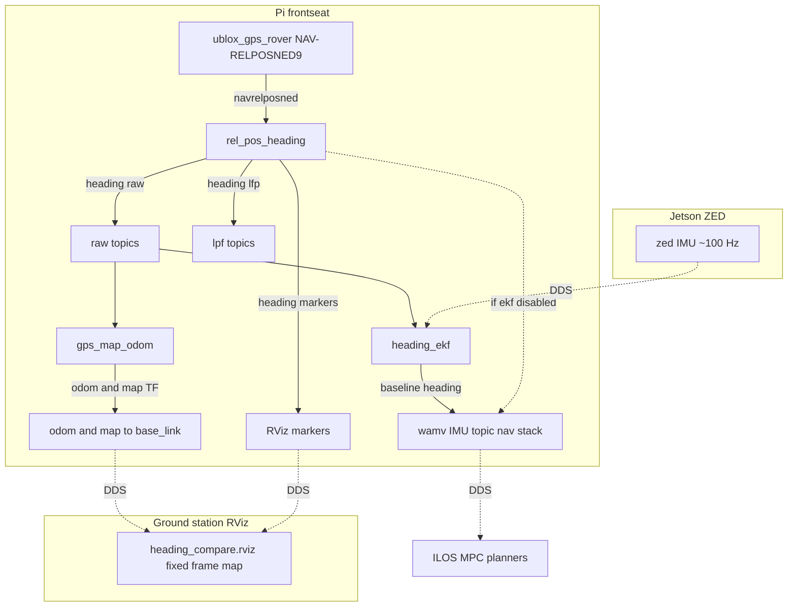

# Heading filters (moving-base RTK)

Dual-antenna u-blox **NAV-RELPOSNED** provides raw yaw at ~8 Hz. Optional **low-pass** and **EKF** filters run in parallel for comparison and nav output. Configuration lives in `filtering.yaml`.

## Architecture



> **Preview note:** Mermaid in Cursor/VS Code can choke on `/`, `*`, or `→` inside node shapes. This diagram uses plain quoted labels. View on GitHub for the richest rendering.

## Topic wiring

| Topic | Publisher | Consumer(s) | Content |
|-------|-----------|-------------|---------|
| `/navrelposned` | `ublox_gps_rover` | `rel_pos_heading` | Raw u-blox relative position + heading |
| `/baseline/heading/raw` | `rel_pos_heading` | `heading_ekf`, RViz | NAV-RELPOSNED yaw (ENU) |
| `/baseline/heading/lfp` | `rel_pos_heading` | RViz | Low-pass yaw |
| `/baseline/heading` | `heading_ekf` *or* `rel_pos_heading` | → `/wamv/sensors/imu/imu/data` | **Nav-stack heading** |
| `/heading/deg` | `heading_ekf` | debug | EKF yaw (degrees) |
| `/baseline/heading/marker/{raw,lfp,ekf}` | `rel_pos_heading`, `heading_ekf` | RViz | Body-frame comparison arrows |
| `/odom`, `map`→`base_link` | `gps_map_odom` | RViz, Nav2, loggers | Position + **definitive** yaw in `map` |

\*Launch remaps `/baseline/heading` → `/wamv/sensors/imu/imu/data` in `rel_pos_heading.launch.py`.

## Which heading is “definitive”?

There is **no** single `output_mode: raw|lpf|ekf` parameter. Selection is implicit:

### Definitive heading (`/wamv/sensors/imu/imu/data`)

| `ekf.enabled` | `low_pass.enabled` | Source |
|:-------------:|:------------------:|--------|
| `true` | (any) | **EKF** (`heading_ekf`) |
| `false` | `true` | **Low-pass** (`rel_pos_heading`) |
| `false` | `false` | **Raw** (`rel_pos_heading`) |

When `ekf.enabled: true`, `rel_pos_heading` stops publishing `/baseline/heading` so it does not collide with `heading_ekf`.

**Consumers of this topic:** controllers (ILOS/MPC/`velocity_odom`), and `gps_map_odom`
(`map`→`base_link` / Nav2 pose). Change the source later by toggling the flags above in
`filtering.yaml` — do not point `gps_map_odom` at `/baseline/heading/raw` or `/lfp`
unless you intentionally want TF decoupled from the nav IMU.

Raw/LPF/EKF **markers** still publish in parallel for RViz comparison.

## Configuration

All filter parameters are in `filtering.yaml`, loaded by `rel_pos_heading.launch.py`.

```yaml
low_pass:
  enabled: true
  alpha: 0.25          # LPF step size (see math below)
ekf:
  enabled: true        # false → rel_pos_heading owns /baseline/heading
  process_noise_var: 0.0001
  max_variance_rad2: 0.005
  gps_variance_scale: 0.02
  use_imu_predict: true  # false → GPS-only EKF (no ZED gyro)
  imu_topic: /zed/zed/imu/data
```

## Filter math

Angles use **ENU yaw** about +Z (radians), wrapped to \([-\pi, \pi]\).

### Low-pass filter (`LowPassHeadingFilter`)

At each GPS sample \(z_k\):

\[
\Delta_k = \mathrm{wrap}(z_k - \hat\psi_{k-1})
\]
\[
\hat\psi_k = \mathrm{wrap}(\hat\psi_{k-1} + \alpha \, \Delta_k)
\]

- \(\alpha\) = `low_pass.alpha` ∈ (0, 1]. Smaller → smoother, more lag.
- First sample: \(\hat\psi_0 = z_0\).

### EKF (`HeadingEkf`)

**State:** \(\psi\) (yaw), \(P\) (variance rad²).

**Predict** (ZED gyro \(\omega_z\), interval \(\Delta t\)) — only when `use_imu_predict: true` and IMU is recent:

\[
\psi \leftarrow \mathrm{wrap}(\psi + \omega_z \Delta t)
\]
\[
P \leftarrow \min(P + q \, \Delta t,\; P_{\max})
\]

where \(q\) = `process_noise_var`, \(P_{\max}\) = `max_variance_rad2`.

**Update** (GPS measurement \(z\), reported variance \(R\)):

\[
R' = R \cdot s \quad (s = \texttt{gps\_variance\_scale})
\]
\[
y = \mathrm{wrap}(z - \psi) \quad \text{(innovation)}
\]
\[
K = \frac{P}{P + R'} \quad \text{(Kalman gain)}
\]
\[
\psi \leftarrow \mathrm{wrap}(\psi + K y)
\]
\[
P \leftarrow \min((1 - K) P,\; R')
\]

**Safety** (`HeadingEkfNode`): if \(|\mathrm{wrap}(z - \psi)| > \texttt{max\_innovation\_reset\_deg}\) before update, the filter resets and re-initializes from GPS.

GPS heading variance \(R\) comes from u-blox `acc_heading` (1σ in \(10^{-5}\) deg) via `heading/relpos.py`.

## Nodes

| Node | Role |
|------|------|
| `rel_pos_heading` | Parse NAV-RELPOSNED, publish raw + LPF + markers; optional final heading |
| `heading_ekf` | Fuse `/baseline/heading/raw` + `/zed/zed/imu/data` → `/baseline/heading` |
| `gps_map_odom` | Latch GPS origin, publish `/odom` + `map`→`base_link` from center fix + heading |

## Launch

```bash
ros2 launch frontseat rel_pos_heading.launch.py
```

Ground-station RViz (comparison):

```bash
./mini_bream_env.sh start gs --heading-compare --no-telemetry
```

Fixed frame: **`map`**. Marker displays: `/baseline/heading/marker/{raw,lfp,ekf}`.
