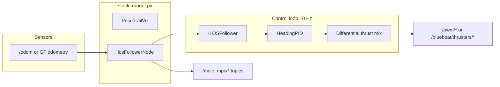

# ILOS Boat — How It Works

This package runs a **closed-loop lemniscate tracking experiment** using **ILOS path guidance + PID heading control + differential thrust**. There is no MPC and no hydrodynamic boat model — thrust is allocated by a simple left/right mix. It mirrors the `h0_boat` experiment pipeline (config overlays, scoring, artifacts) but replaces the MPC thrust allocator with direct differential mixing.

---

## Architecture



| File | Role |
|------|------|
| `ilos_follower.py` | Main ROS2 controller node |
| `stack_runner.py` | Runs helper nodes + follower in one process |
| `run_ilos_experiment.py` | Full scored experiment orchestrator |
| `trial_runner.py` | Shared trial logic (start stack, wait, score, stop) |
| `tune_ilos.py` | Bayesian parameter optimization |
| `config.py` | YAML config merging |
| `ros_env.sh` | Source Humble, workspace overlay, CycloneDDS |
| `run_ilos_boat.sh` | ROS env + `run_ilos_experiment.py` |
| `run_real_boat.sh` | Main launcher (topic checks, then experiment) |

---

## Control Algorithm

The mission is to track a **Dubins-smoothed lemniscate** in a local ENU `world` frame, anchored at the boat's first GPS fix.

1. **Cross-track error** — signed distance to path tangent:

   \[
   e_y = -\sin\psi_p\,(x - x_p) + \cos\psi_p\,(y - y_p)
   \]

2. **ILOS desired heading** — variable lookahead \(\Delta(e_y) \in [\Delta_{\min}, \Delta_{\max}]\):

   \[
   \psi_d = \atan\!\left(-\hat\beta - \frac{e_y}{\Delta}\right) + \psi_p
   \]

   (\(\hat\beta\) is an integral state; \(\gamma=0\) disables integral action in the default config.)

3. **PID yaw-rate command** — heading error \(\tilde\psi = \mathrm{wrap}(\psi_d - \psi)\):

   \[
   r_{\mathrm{cmd}} = \mathrm{clip}\!\left(K_p \tilde\psi + K_d \dot{\tilde\psi},\,-r_{\max},\,r_{\max}\right)
   \]

4. **Surge command** — cruise speed scaled down in turns and large heading error:

   \[
   U_{\mathrm{cmd}} = U_c \cdot s_{\mathrm{head}}(\tilde\psi) \cdot \frac{1}{1 + k_\kappa |\kappa|}
   \]

5. **Differential thrust** — normalized left/right mix:

   \[
   \tau_{\mathrm{surge}} = \mathrm{clip}\!\left(g_s \frac{U_{\mathrm{cmd}}}{U_{\mathrm{ref}}},\,\tau_{\min},\,1\right), \quad
   \tau_{\mathrm{yaw}} = g_y \frac{r_{\mathrm{cmd}}}{r_{\max}}
   \]

   \[
   \tau_L = \tau_{\mathrm{surge}} - \tau_{\mathrm{yaw}}, \qquad
   \tau_R = \tau_{\mathrm{surge}} + \tau_{\mathrm{yaw}}
   \]

On the real boat, these go to `/pwm/left_thrust_cmd` and `/pwm/right_thrust_cmd` → `motor_controller` → `pwm_daemon`.

**Scoring:** RMSE of \(|e_y|\) from `/molo_mpc/cross_track_error` over the evaluate window. **Target: 0.1 m**.

---

## Experiment Pipeline

When you run a full experiment (`run_real_boat.sh`), `trial_runner.run_boat_trial()` does:

1. Kill any existing stack
2. Wait for GPS fix (if origin not preset) → anchor the lemniscate
3. Start `stack_runner.py` with merged config
4. **Warmup** — let the boat settle and path activate
5. Save `ref_path.csv` and `origin.json`
6. Wait for cross-track error topic
7. **Evaluate** — run `evaluate_mpc.py` for the configured duration
8. Stop stack, write `result.json` (RMSE, pass/fail)

---

## Configuration Layers

```
ilos_base.yaml              # algorithm + lemniscate mission
  └── platform overlay      (--platform sim|real|bench)
        └── ilos_tuned_overlay.yaml  (auto-merged if present)
```

| Overlay | Platform |
|---------|----------|
| `ilos_sim_overlay.yaml` | Gazebo (`blueboat_sim`), ground-truth pose |
| `ilos_boat_overlay.yaml` | Real boat (`frontseat`), GPS+IMU fusion |
| `ilos_bench_overlay.yaml` | Real sensors, thrust to sink topics (no motors) |
| `ilos_tuned_overlay.yaml` | BO best params (optional, created by `--tune --install`) |

Key defaults in `ilos_base.yaml`: lemniscate scale 7 m, cruise 0.25 m/s, evaluate 60 s (sim) / 55 s (real).

---

## How to Run

Run from inside `mini_bream_autonomy`. Bring up the platform topics first; the launcher waits for GPS/IMU (and `motor_controller` on `--platform real`) before starting.

### Simulation

**Terminal 1 — start Gazebo:**

```bash
cd src/docker
./mini_bream_env.sh start sim
```

**Terminal 2 — start autonomy** (if needed):

```bash
cd src/docker
./mini_bream_env.sh start autonomy
```

**Inside autonomy:**

```bash
docker exec -it mini_bream_autonomy bash
cd /workspace/ros2_ws/src/molo_wpt_follower/ilos_boat
./run_real_boat.sh --platform sim           # full run
./run_real_boat.sh --platform sim --smoke   # shortened window
./run_real_boat.sh --platform sim --dry-run # config + ref_path only
```

**Optional RViz** (while running):

```bash
cd src/docker
./mini_bream_env.sh start gs --h0-boat --sim-viz
```

**Controller only** (no scoring, good for RViz debugging):

```bash
./run_stack.sh --platform sim
```

Results go to `ilos_boat/results/<timestamp>/`.

---

### Real Boat (Field Test)

**1. Start the Pi stack** so GPS/IMU and `motor_controller` exist on the domain:

```bash
cd src/docker
./mini_bream_env.sh start pi
```

**2. Start autonomy** on Jetson/dev:

```bash
cd src/docker
./mini_bream_env.sh start autonomy
```

**3. Release radio deadman** (`arm=false`).

**4. Inside autonomy:**

```bash
docker exec -it mini_bream_autonomy bash
cd /workspace/ros2_ws/src/molo_wpt_follower/ilos_boat
./run_real_boat.sh                    # full run (default: --platform real)
./run_real_boat.sh --bench            # GPS/IMU live, no motors
./run_real_boat.sh --smoke            # shortened evaluate window
```

**RViz** (ground station):

```bash
cd src/docker
./mini_bream_env.sh start gs --h0-boat
```

Results go to `/workspace/field_tests/ilos_boat/<timestamp>/` (host: `src/field_tests/ilos_boat/`).

---

## Fine-Tuning (Bayesian Optimization)

Tunes **14 parameters** (ILOS lookahead, PID gains, yaw mix, surge gain, speed scaling, etc.) using scikit-optimize (`gp_minimize`, Expected Improvement). No MPC weights.

### Simulation tuning

```bash
# Inside autonomy, with /blueboat/sensors/... already up
cd /workspace/ros2_ws/src/molo_wpt_follower/ilos_boat
./run_real_boat.sh --platform sim --tune --install    # 28 trials → config/ilos_tuned_overlay.yaml
./run_real_boat.sh --platform sim --tune --quick      # 8 trials (smoke)
```

### Field fine-tuning

```bash
./run_real_boat.sh --platform real --tune --install --n-calls 20
./run_real_boat.sh --platform bench --tune            # sensors only, no motors
```

### Refine around a prior result

```bash
./run_real_boat.sh --platform sim --tune --refine results/tune_sim_20260727/tune_result.json
```

Tuning outputs:

- `tune_result.json` — best params, validation RMSE, pass/fail
- `ilos_tuned_overlay.yaml` — patch to apply (also copied to `config/` with `--install`)
- `trials/trial_XXXX/` — per-trial logs
- `best_validation/` — final validation run

---

## Artifacts Per Run

Written to `<out>/ILOS_PID/`:

| File | Contents |
|------|----------|
| `config.yaml` | Merged config used for the run |
| `log.csv` | State, XTE, thrust log (t, x, y, psi, u, v, r, xte, …) |
| `ref_path.csv` | Reference lemniscate samples |
| `origin.json` | Path activation origin (first GPS fix) |
| `result.json` | RMSE, pass/fail, platform metadata |
| `plots/` | Validation plots (unless `--no-plot`) |

---

## Comparison to H0

| | **ILOS boat** (this package) | **H0 boat** |
|--|------------------------------|-------------|
| Guidance | ILOS + PID | Same ILOS + PID |
| Thrust allocation | Direct differential mix | Velocity MPC |
| Boat model | None | Hydrodynamic model |
| Complexity | Lower, faster to tune | Higher, potentially better performance |

Both share the same experiment infrastructure, RViz config (`--h0-boat`), and scoring methodology.

---

## RViz Topics

Uses the shared `h0_boat.rviz` config (`--h0-boat` / `--ilos-boat`):

| Display | Topic | ILOS publishes? |
|---------|-------|-----------------|
| Reference Path | `/molo_mpc/ref_path` | yes (once at path start) |
| Traversed Path | `/molo_mpc/traversed_path` | yes |
| Vehicle Pose | `/molo_mpc/vehicle_pose` | yes |
| Recent Poses | `/molo_h0/recent_poses` | yes |
| Predicted Path | `/molo_mpc/pred_path` | no (MPC only) |
