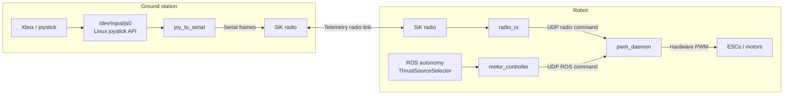

# Emergency teleop (non-ROS motor path)

## Goal

Keep a joystick override that still works if the robot ROS 2 stack dies.
ROS autonomy can run normally; radio teleop **overrides** it when armed.

## Roles

| Service | Where | Compose file | Role |
|---------|-------|--------------|------|
| `telemetry_tx` | Ground PC | `docker-compose.ground.telemetry.yaml` | Linux `js*` reader + `joy_to_serial` → telemetry radio |
| `ground_station` | Ground PC (`.103`) | `docker-compose.ground.yml` | RViz2 viewer for robot ROS topics (DDS) |
| `pwm_daemon` | Robot | `docker-compose.frontseat.yml` | **Only** process that writes motor PWM; mux + failsafe |
| `radio_rx` | Robot | `docker-compose.frontseat.yml` | Serial from radio → UDP to daemon (no ROS) |
| `frontseat` | Robot | `docker-compose.frontseat.yml` | ROS stack; `motor_controller` sends thrust to daemon over UDP |

### Ground station roles

**`telemetry_tx`** does **not** use ROS. It reads the controller via `/dev/input/js0` and sends framed packets over the SiK radio. The container uses Docker’s default bridge network, so it is isolated from robot DDS. The only teleop link to the boat is the **serial telemetry radio**.

**`ground_station`** (separate compose file) is for **RViz2** on the ground PC (`192.168.0.103`). It joins the same Cyclone DDS domain as Pi and Jetson to visualize LiDAR, camera, GPS, etc. It does not send motor commands.

(We intentionally avoid ROS 2 `joy_node` on the GS teleop container: it uses SDL and often fails to publish for Xbox 360 wireless receivers that still work fine as `/dev/input/js0`.)

## Data flow



### Mux priority (inside `pwm_daemon`)

1. **Radio** if `arm=true` and packet age ≤ profile `radio_timeout_s` (default 0.25 s)
2. Else **ROS** if `arm=true` and packet age ≤ profile `ros_timeout_s` (default 0.5 s)
3. Else **stop** (thrust 0)

## Device profiles (PWM backend + pins)

Defaults live in JSON, not scattered env vars:

| File | Platform | Backend | Pins |
|------|----------|---------|------|
| `devices/rpi.json` | Raspberry Pi | `pigpio` (hardware PWM) | BCM 19 / 12 (phys 35 / 32) |
| `devices/jetson.json` | Jetson Orin | `jetson` | BOARD 33 / 32 |

`pigpio` uses **hardware PWM** via `pigpiod` (built into the teleop image and started by `entrypoint.teleop.sh`). On Pi 4 use BCM **12 + 19** (physical pins 32 + 35). Avoid GPIO **13** — on some Pi 4 boards pigpio `hardware_PWM` never toggles that pin.

Select with `DEVICE_CONFIG`:

```bash
DEVICE_CONFIG=rpi docker compose -f docker-compose.frontseat.yml up -d pwm_daemon
DEVICE_CONFIG=jetson docker compose -f docker-compose.frontseat.yml up -d pwm_daemon
```

Safe bring-up without moving motors (override backend only):

```bash
DEVICE_CONFIG=rpi PWM_BACKEND_OVERRIDE=dry_run \
  docker compose -f docker-compose.frontseat.yml up -d pwm_daemon
```

## Finding the SiK telemetry radio serial port

SiK Telemetry Radio v3 usually appears as an **FTDI FT231X** USB-UART (not as `ttyACM*` — those are often GPS).

**1. List stable IDs (preferred):**

```bash
ls -l /dev/serial/by-id/
```

Example on this robot:

```text
usb-FTDI_FT231X_USB_UART_D30GKEF6-if00-port0 -> ../../ttyUSB0   ← SiK radio
usb-u-blox_AG_-_..._u-blox_GNSS_receiver-if00 -> ../../ttyACM1 ← GPS
```

Use the **by-id** path in compose so it survives reboot / USB reorder:

```bash
export RADIO_SERIAL_PORT=/dev/serial/by-id/usb-FTDI_FT231X_USB_UART_D30GKEF6-if00-port0
```

**2. Confirm vendor/product:**

```bash
udevadm info -q property -n /dev/ttyUSB0 | grep -E 'ID_VENDOR|ID_MODEL|ID_SERIAL'
```

SiK v3 typically shows `ID_VENDOR=FTDI` and `ID_MODEL=FT231X_USB_UART`.

**3. Unplug/replug test:**

```bash
dmesg -w
# unplug radio, plug back — look for FTDI / ttyUSB
```

**4. Baud:** SiK default is often **57600** (set `RADIO_BAUD` if you changed air/radio settings).

GPS modules (`u-blox` → `ttyACM*`) are **not** the telemetry radio — leave those for the frontseat GPS launch files.

## Serial protocol

9-byte little-endian frame (see `protocol.py`):

`AA 55 | left_i16 | right_i16 | flags | seq | crc8`

- Thrust: `i16 = round(thrust * 1000)`, range `[-1, 1]`
- `flags` bit0 = **arm** (deadman held — default **button[5]**)

## IPC to the daemon

UDP JSON to `127.0.0.1:5600` (host network on the robot):

```json
{"source":"ros"|"radio","left":0.2,"right":-0.1,"arm":true,"seq":1}
```

## Controller setup — what to run (both machines)

Plug in the SiK radio on **both** sides and the Xbox receiver on the ground PC first.

### 0) Identify devices (each machine)

```bash
# Joystick (ground PC only)
ls -l /dev/input/js*

# SiK radio (both machines) — prefer by-id, see section above
ls -l /dev/serial/by-id/
```

Optional: map axes/buttons on the ground PC before starting compose:

```bash
# stop telemetry container if it already holds js0
docker stop mini_bream_telemetry_tx 2>/dev/null
cd <repo>/src
python3 teleop/js_dump.py          # move sticks / press buttons; note indices
```

Current Xbox defaults (after mapping):

| Control | Index | Flag |
|---------|-------|------|
| Left thrust | `axis[1]` | `--left-axis 1` |
| Right thrust | `axis[4]` | `--right-axis 4` |
| Deadman (arm) | `button[5]` | `--deadman-button 5` |

### 1) Robot (Raspberry Pi) — start first

```bash
cd <repo>/src/docker

# Safe bring-up (logs thrust, does not drive ESCs)
DEVICE_CONFIG=rpi PWM_BACKEND_OVERRIDE=dry_run \
RADIO_SERIAL_PORT=/dev/serial/by-id/usb-FTDI_FT231X_USB_UART_<ROBOT_SERIAL>-if00-port0 \
  docker compose -f docker-compose.frontseat.yml up -d --build pwm_daemon radio_rx

# When ready for real motors, omit PWM_BACKEND_OVERRIDE (uses devices/rpi.json → pigpio hw PWM)
# DEVICE_CONFIG=rpi RADIO_SERIAL_PORT=... docker compose -f docker-compose.frontseat.yml up -d pwm_daemon radio_rx

# Optional: ROS autonomy / frontseat (separate; not required for radio override)
docker compose -f docker-compose.frontseat.yml up --build frontseat
```

Watch robot logs:

```bash
docker logs -f mini_bream_pwm_daemon
docker logs -f mini_bream_radio_rx
```

You want `radio_rx` to open the SiK port, and when the GS is armed, `pwm_daemon` should show `Active source → radio`.

### 2) Ground PC — emergency teleop transmitter

```bash
cd <repo>/src/docker

RADIO_SERIAL_PORT=/dev/serial/by-id/usb-FTDI_FT231X_USB_UART_<GS_SERIAL>-if00-port0 \
JOY_DEVICE=/dev/input/js0 \
  docker compose -f docker-compose.ground.telemetry.yaml up --build
```

Watch telemetry logs:

```bash
docker logs -f mini_bream_telemetry_tx
```

Expect something like:

```text
Joystick /dev/input/js0 (8 axes, 15 buttons) → serial ... [left=axis[1] right=axis[4] deadman=button[5]]
```

Hold **button[5]** → log `Deadman ARMED`; release → `disarmed` / robot falls back to ROS or stop.

### Order summary

1. Power radios + Xbox receiver  
2. On **Pi**: `pwm_daemon` + `radio_rx` (`docker-compose.frontseat.yml`)  
3. On **ground PC**: `telemetry_tx` (`docker-compose.ground.telemetry.yaml`)  
4. Hold deadman (**button[5]**), move **axis[1]** / **axis[4]**, confirm Pi daemon logs  

### RViz2 on ground PC (optional)

On the ground-station computer (`192.168.0.103`), with Pi/Jetson stacks running:

```bash
cd <repo>/src/docker
xhost +local:docker
docker compose -f docker-compose.ground.yml up --build
```

## Failsafe notes

- Ground station always sends frames; with deadman released, `arm=0` and thrust 0.
- If radio goes silent longer than the timeout, radio priority drops immediately.
- If ROS also dies, daemon holds stop.
- `pwm_daemon` should stay up (`restart: unless-stopped`); it is the safety-critical service.
